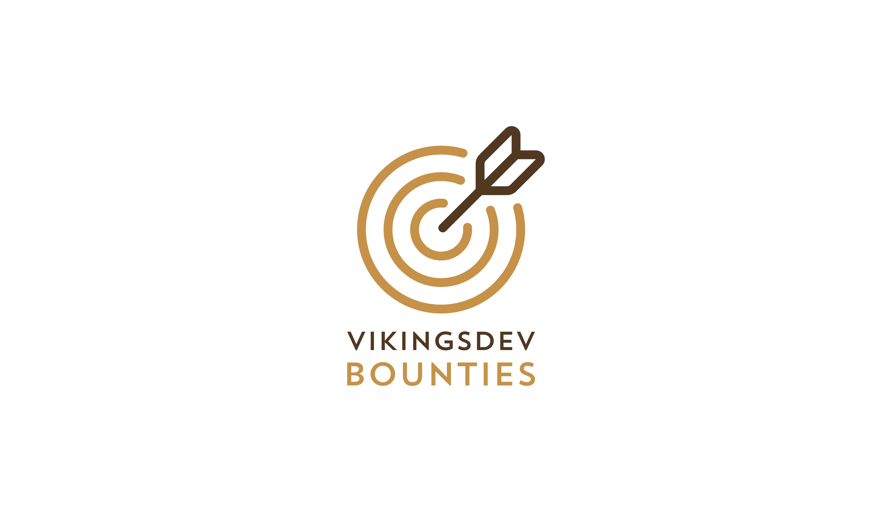

<a href="https://vikingsdev.ca/bounties"></a>
# VikingsDev Bounties - Full Documentation
Hunting guidelines for VikingsDev Bounties.
<br><br><br>


## How to hunt a bounty
1. [Create a GitHub Account](https://github.com/join)
2. Submit a pull request at a GitHub repository.
3. Have the pull request merged.
4. Submit pull request link to [VikingsDev](https://vikingsdev.ca/demo)
<br><br><br>


## Bounty System

To have a valid pull request:
1. Pull request must be on GitHub
2. Pull request must be merged
3. Pull request must not have the label `invalid`
4. Pull request must be made by your account
5. Pull request must not have been submitted before

- Your first submitted bounty will gain 5 points and 5 stickers.
- Every bounty after will get 5 points for two stickers.
### Appeals
- An appeal can be made to get more points for a pull request by messaging using messenger [here](https://m.me/join/AbZu1Gg5blkFvuSQ) or email vikingsdev@gmail.ca. You must include the following information:
```
Your Github Username: GITHUB_USERNAME
Repository Name: Owner/Repo
Pull Request Number: NUMBER
Requested Points: X
Have you submitted this claim yet? Y/N
Reason for Appeal (optional): REASON
```
<br><br><br>


## Crown System

The top three hunters will be recorded on the day marks are due for teachers at 11:59pm PST and will be able to choose from a 
pool of prizes in priority of how they ended up on the leaderboard. Prize pool is tentative and will depend on the club's financial situation.

How the leaderboard ranks:
  1. Sort by points. If points are equal go to 2.
  2. Sort by number of projects. If number of projects are equal go to 3.
  3. Sort by the last submitted epoch time (priority to older submission)
<br><br><br>


## Bounty Hunter Badge

After 5 valid submitted pull requests. you can ask for a holographic Bounty Hunter Badge, which identifies all true bounty hunters. You can only get this sticker once.

## Rate Limits

Everytime you submit a claim to vikingsdev.ca/demo, your pull request information is checked against the GitHub API to see whether your pull request is valid or not by pinging api.github.com. GitHub's API has a rate limit of 60 requests per hour, that is, we can only ping the API 60 times in one hour. This means that you can only make 60 claims per hour.

This is why you see the message `You can make X more claims this hour. This will reset to 60 at H:MM AM/PM.` on the demo page. 

If you reach more than 60 pings to the GitHub API in one hour, you will be rate limited, which means you won't be able to ping the API for another 30 minutes. 
